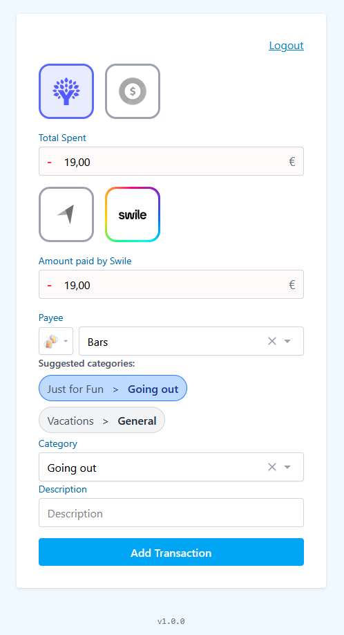

# Expense PWA

A Progressive Web App for quickly adding expenses to both [YNAB (You Need A Budget)](https://ynab.com) and [SettleUp](https://settleup.io/). This app allows you to enter an expense once and automatically send it to both platforms.



## Features

- 📱 **Progressive Web App** - Works offline and can be installed on any device
- 💰 **YNAB Integration** - Automatically create transactions in your YNAB budget
- 👥 **SettleUp Integration** - Add shared expenses to your SettleUp groups
- 🎯 **Smart Categories** - Suggests categories based on your transaction history
- 📍 **Location-aware** - Automatically suggests payees based on your location
- 💳 **Swile Support** - Special handling for Swile meal voucher amounts
- 🔄 **Real-time Sync** - Instant synchronization with both platforms
- 🎨 **Modern UI** - Clean, responsive design with smooth animations

## Tech Stack

- **Frontend**: React 18 with Vite
- **Styling**: Tailwind CSS
- **Animations**: Framer Motion
- **PWA**: Vite PWA Plugin
- **APIs**: YNAB API, SettleUp Firebase API
- **Authentication**: Firebase Auth with FirebaseUI
- **Icons**: React Icons, Emoji Mart

## Getting Started

### Prerequisites

- Node.js (version 16 or higher)
- A [YNAB](https://ynab.com) account with API access (see [Getting API Keys](#getting-api-keys) section)
- A [SettleUp](https://settleup.io/) account (see [Getting API Keys](#getting-api-keys) section)

### Installation

1. **Clone the repository**

   ```bash
   git clone https://github.com/SThor/expense-pwa.git
   cd expense-pwa
   ```

2. **Install dependencies**

   ```bash
   npm install
   ```

3. **Set up environment variables**

   ```bash
   cp .env.sample .env
   ```

4. **Configure your `.env` file**

   Update the `.env` file with your YNAB Personal Access Token and SettleUp Firebase configuration.

5. **Start the development server**

   ```bash
   npm run dev
   ```

The app will be available at `http://localhost:5173`

### Getting API Keys

#### YNAB Personal Access Token

1. Log into your YNAB account
2. Go to Account Settings → Developer Settings
3. Click "New Token" and follow the instructions
4. Copy the token to your `.env` file

#### SettleUp Setup

The app uses SettleUp's sandbox environment by default for testing. For production use:

1. Contact SettleUp for production API credentials (see [SettleUp API documentation](https://settleup.io/api.html))
2. Update the Firebase configuration in your `.env` file
3. Set `VITE_SETTLEUP_DUMMY=false` to use real data

## Usage

### Adding an Expense

1. **Amount**: Enter the expense amount
2. **Account Selection**: Choose which YNAB accounts to use
3. **Swile Integration**: If you have Swile meal vouchers, toggle the Swile section
4. **Details**:
   - Select a payee (auto-suggested based on location)
   - Choose a category (smart suggestions based on history)
   - Add a memo if needed
5. **Review & Submit**: Review your expense and submit to both platforms

### Features in Detail

#### Smart Category Suggestions

The app analyzes your SettleUp transaction history and suggests the most commonly used categories for similar expenses.

#### Location-based Payee Suggestions

Using your device's location, the app suggests nearby payees from your YNAB transaction history.

#### Swile Integration

Special handling for Swile meal vouchers with automatic amount calculations and dedicated UI sections.

## Development

### Available Scripts

- `npm run dev` - Start development server
- `npm run build` - Build for production
- `npm run preview` - Preview production build locally
- `npm test` - Run tests
- `npm run test:coverage` - Run tests with coverage
- `npm run lint` - Run ESLint
- `npm run lint:fix` - Fix linting issues automatically

## Deployment

This app is designed to be deployed as a static site with automatic deployments.

### Production Setup

1. **Environment Configuration**: Copy `.env.sample` to `.env` and configure your production values
2. **GitHub Actions**: Automatic deployment is configured via GitHub Actions
3. **HTTPS**: Production deployment includes automatic SSL certificate management
4. **PWA Features**: Service worker and offline capabilities are enabled in production builds

### Manual Deployment

If you prefer manual deployment:

```bash
# Build the app
npm run build

# Deploy the dist/ folder to your web server
```

The app is optimized for static hosting and works great with services like Nginx, Apache, or any CDN.

### Project Structure

```text
src/
├── App.jsx                 # Main application component
├── AppContext.jsx          # Global application context
├── AuthProvider.jsx        # SettleUp authentication
├── MainFormPage.jsx        # Main form interface
├── ReviewPage.jsx          # Transaction review page
├── LoginPage.jsx           # Authentication page
├── constants.js            # Application constants
├── api/
│   └── settleup.js        # SettleUp API integration
├── components/            # Reusable UI components
├── hooks/                 # Custom React hooks
└── utils/                # Utility functions
```

### Specific documentation

- [Version Display System](doc/VERSION_DISPLAY.md) - Automatic git-based version display on all pages
- [Contributing Guidelines](CONTRIBUTING.md)
- [Code of Conduct](CODE_OF_CONDUCT.md)
- [Security Policy](SECURITY.md)
- [Changelog](CHANGELOG.md)

## License & Third-Party Assets

This project is licensed under the MIT License. See the [LICENSE](LICENSE) file for details.

Some logo/image assets in this repository (e.g., boursobank, swile, ynab, settleup icons) are not covered by the MIT license. See the [NOTICE](NOTICE) file for details.

This project and its author are **not affiliated with, endorsed by, or sponsored by YNAB, SettleUp, Swile, Boursorama, or any other brand whose logo may appear in this repository**. All trademarks and logos are the property of their respective owners and are used here for identification or integration purposes only.
